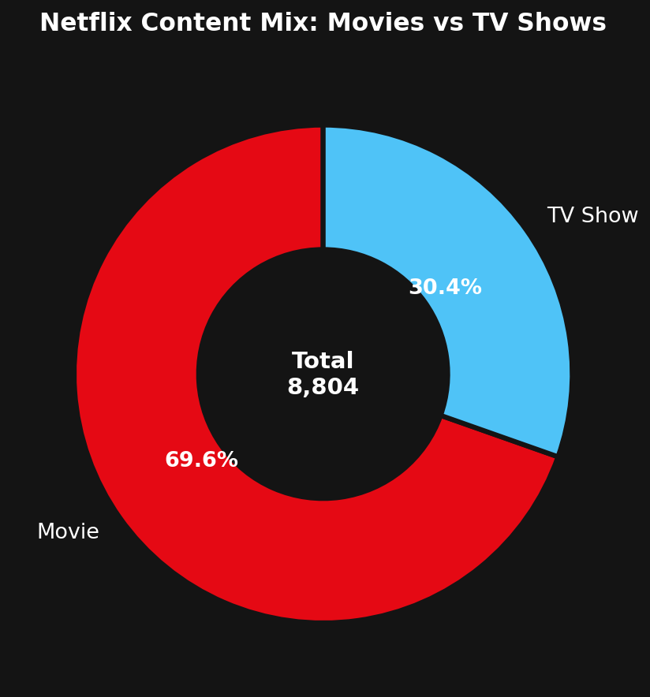

# 🎬 Netflix Content Strategy Analysis

## 📋 Project Overview
End-to-end data analytics project analyzing 8,800+ Netflix titles across 88 countries to deliver actionable business recommendations.

## 🎯 Key Results
| Metric | Value |
|--------|-------|
| Total Titles Analyzed | 8,804 |
| Countries Covered | 88 |
| Business Questions Answered | 10 |
| Recommendations Delivered | 5 |

## 🛠️ Tech Stack
| Tool | Purpose |
|------|---------|
| Python | Data cleaning & EDA |
| Pandas & NumPy | Data manipulation |
| Matplotlib & Seaborn | Visualizations |
| MySQL | SQL analysis |
| Power BI | Dashboard |
| GitHub | Portfolio |

## 📊 Visualizations

### Executive Dashboard


### Content Type Split


### Yearly Trend


### Top Countries


### Top Genres


### Rating Distribution


### Movie Duration Trend


### Monthly Pattern


### Content Freshness


### TV Seasons


### KPI Summary


## 💡 Top 5 Recommendations
1. Increase TV Show investment from 30% to 45%
2. Expand international content beyond USA
3. Increase Family content from 12% to 25%
4. Minimum 400 titles added per month
5. Shift originals ratio from 33% to 55%

## 📁 Project Structure
```
netflix-content-analysis/
├── data/
│   ├── raw/
│   └── cleaned/
├── notebooks/
├── sql/
├── dashboard/
├── visuals/
└── docs/
```

## 👤 Author
**Gopi** — Aspiring Data Analyst
